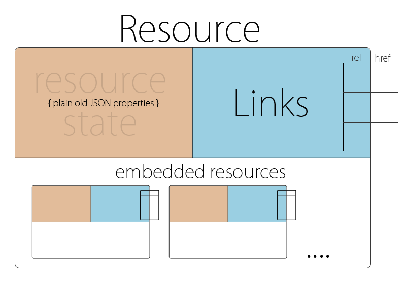

# HAL - Hypertext Application Language

### [Link](https://stateless.co/hal_specification.html)
___

<br>

### Sumario
___

HAL é uma forma fácil de criar links dentro da sua API. 
Isso a torna exploravel e sua documentação poderá ser descoberta
através da própria API.

<br>

### Descrição Geral
___

HAL estipula uma série de regras e convenções para expressar hyperlinks in JSON ou XML.

Um documento HAL é apenas JSON ou XML.

HAL é feito para que maquinas possam navegar por uma api automaticamente.

<br>

### Examples
___

The example below is how you might represent a collection of orders with hal+json. Things to look for:

* The URI of the main resource being represented ('/orders') expressed with a self link
* The 'next' link pointing to the next page of orders
* A templated link called 'ea:find' for searching orders by id
* The multiple 'ea:admin' link objects contained in an array
* Two properties of the orders collection; 'currentlyProcessing' and 'shippedToday'
* Embedded order resources with their own links and properties
* The compact URI (curie) named 'ea' for expanding the name of the links to their documentation URL

```json
{
    "_links": {
        "self": { "href": "/orders" },
        "curies": [{ "name": "ea", "href": "http://example.com/docs/rels/{rel}", "templated": true }],
        "next": { "href": "/orders?page=2" },
        "ea:find": {
            "href": "/orders{?id}",
            "templated": true
        },
        "ea:admin": [{
            "href": "/admins/2",
            "title": "Fred"
        }, {
            "href": "/admins/5",
            "title": "Kate"
        }]
    },
    "currentlyProcessing": 14,
    "shippedToday": 20,
    "_embedded": {
        "ea:order": [{
            "_links": {
                "self": { "href": "/orders/123" },
                "ea:basket": { "href": "/baskets/98712" },
                "ea:customer": { "href": "/customers/7809" }
            },
            "total": 30.00,
            "currency": "USD",
            "status": "shipped"
        }, {
            "_links": {
                "self": { "href": "/orders/124" },
                "ea:basket": { "href": "/baskets/97213" },
                "ea:customer": { "href": "/customers/12369" }
            },
            "total": 20.00,
            "currency": "USD",
            "status": "processing"
        }]
    }
}
```

<br>

### O Modelo HAL 
___

As convenções do HAL focam em represetar dois conceitos: Recursos e Links

**Recursos:**

* Links (para URI's)
* Embedded resources (outros recursos dentro do recurso)
* State 

**Links:**

* Target (a URI)
* Relação aka rel (nome do link)
* Outras informações para ajudar com conteudo, negociação, depreciação etc



<br>

### Como HAL é usado em APIs
___

HAL é usado para construir APIs onde os clientes possam navegar entre os recursos através de **Links**.

Links são identificados por **link relations**. Link relations:

* Diz quais recursos estão disponiveis
* Como interagir com eles
* Como o codigo escrito pelos clientes escolherá o link para transversar

Links não são apenas string, mas URL's.

HAL encoraja o uso de **links relations** para:

* Identificar links e recursos embutidos na representação
* Inferir a estrutura e o sentido do recurso alvo
* Sinalizar quais requisições e representações poderão ser mandadas pro recurso alvo

<br>

### Como Servir HAL
___

HAL has a media type for both the JSON and XML variants, whos names are application/hal+json and application/hal+xml respectively.

When serving HAL over HTTP, the Content-Type of the response should contain the relevant media type name.

<br>

### Estrutura
___

**Minimun valid document:**

Um documento HAL deve conter no minimo um recurso vazio:

```json 
{}
```

**Recursos:**

Na maioria dos casos um recurso deve conter um URI próprio:

```json
{
   "_links": {
      "self": {"href": "/example_resource" }
   }
}
```

**Links:**

Links devem ser contidos diretamente em um recurso:

Links são represetandos por um JSON object dentro de um _link hash que deve ser uma propriedade direto do recurso:

```json
{
   "_links": {
      "next": {"href": "/page=2" }
   }
}
```

**Links Relations:**

Links possuem relações que indicam o sentido do link.

É, basicamente, uma chave dentro da chave _link que associa o sentido do link com o objeto que possui o dado.
Nesse caso, o objeto que possui o dado seria o href:

```json
{
   "_links": {
      "next": {"href": "/page=2" }
   }
}
```

**Exploração de APIs:** 

Links rels devem ser URLs que revelam documentação sobre o link. 
URLs geralmente são muito grandes e meio dificeis de usar como chaves, por isso HAL oferece 
"CURIES", que basicamente são tokens que você pode definir no documento e usar para expressar
as urls de forma mais compacta.

<br>

### Representado Multiplos Links Com A Mesma Relação
___

Um recurso pode ter diversos links que compartilham o mesmo Link Rel.

Para Link Rels que podem ter diversos links usa-se um array:

```json
{
   "_links" : {
      "items": [{
         "href": "/first_item"
      },{
         "href": "/second_item"
      }]
   }
}
```

>**_Note:_** If you're unsure whether the link should be singular, assume it will be multiple. If you pick singular and find you need to change it, you will need to create a new link relation or face breaking existing clients.

<br>

### CURIEs
___

CURIEs servem para compactar links

```json
"_links": {
   "curies": [
      {
         "name": "doc",
         "href": "http://haltalk.herokuapp.com/docs/{rel}",
         "templated": true
      }
   ],

   "doc:latest-posts": {
      "href": "posts/latests"
   }
}
```   